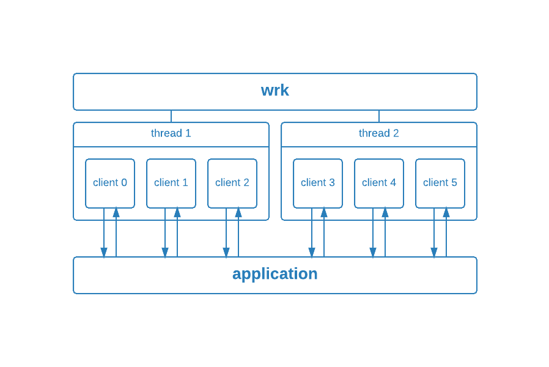
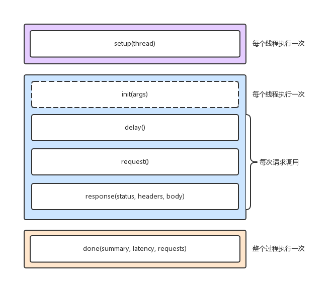

Modern HTTP benchmarking tool--wrk
===

1.概念简介
---

系统性能描述是系统或组件在给定约束中实现的指定功能的程度，诸如速度、正确性、内存使用等。  性能测试报告中，对系统性能的描述应该是多方面的，如：执行效率、稳定性、兼容行、可靠性、可扩展性容量等，执行效率通过并发用户数、响应时间、吞吐量、成功率、资源消耗综合体现。

性能测试: `负载测试、压力测试、并发测试、容量测试，通过不同测试手段，获得或验证性能指标，性能测试会在不同负载情况下进行`

####1) 并发测试

`当测试多用户并发访问同一个应用、模块、数据时是否产生隐藏的并发问题，如内存泄漏、线程锁、资源争用问题`

####2) 负载测试

`模拟在超负荷环境中运行,通过不断加载(如逐渐增加模拟用户的数量)或其它加载方式来观察不同负载下系统的响应时间和数据吞吐量系统占用的资源(如CPU内存)等,以检验系统的行为和特性,以发现系统可能存在的性能瓶颈、内存泄漏、不能实时同步等问题，是一种测试方法`

####3) 压力测试

`高负载(大数据量大量并发用户等)下的测试,查看应用系统在峰值使用情况下操作行为,从而有效地发现系统的某项功能隐患系统是否具有良好的容错能力和可恢复能力。压力测试分为高负载下的长时间(如24小时以上)的稳定性压力测试和极限负载情况下导致系统崩溃的破坏性压力测试`

####4) 容量测试

`通过测试预先分析出反映软件系统应用特征的某项指标的极限值（如最大并发用户数），系统在其极限状态下没有出现任何软件故障或还能保持主要功能正常运行。容量测试是面向数据的,并且它的目的是显示系统可以处理目标内确定的数据容量。可以视为破坏性压力测试的一种副产品`

2.HTTP性能测试指标
---

####1) 并发数
`时间段内同时发起的连接数`

####2) 响应时间
`从发起到完成请求所经过的时间`
[^_^]: (包括网络传输、应用服务处理、数据库服务处理时间)

####3) TPS
`每秒钟完成的事务/请求数`
[^_^]: (字节/秒、请求数/秒、页面数/秒)

3.需求
---
支持POST

支持SSL

吞吐量基本的信息

报表等

4.压测软件，走过的坑
---

|             |  并发量 | https  |  POST  | 报告完善度 | 可扩展性 |
| --------    | -----:  | :----: | :----: |   :----:   |  :----:  |
| http_load   | 中      |   Y    |   N    |    中      |    中    | select
| webbench    | 高      |   Y    |   N    |    中      |    中    | fork
| ab          | 高      |   Y    |   Y    |    极高    |    中    |  
| siege       | 低      |   Y    |   Y    |    高      |    中    | multi thread + poll/select
| wrk/wrk2    | 极高    |   Y    |   Y    |    高      |    高    | epoll

[^_^]: ab单线程,cpu利用不够充分，操作简便易用，报表丰富，并发量高，但无法达到2w+

[^_^]: curl-loader每个均拥有自己的源IP,信息量过少，实时输出成功失败数；但在模拟user时，会构建虚拟网卡，在这个过程中，导致虚拟机无法访问外网，操作不够简便

[^_^]: siege并发量为线程数，并发量过大时，线程间切换会影响并发性能

[^_^]: wrk2存在延迟计算异常的情况，而且wrk2增加校准测试时间，统计详细请求频率等功能对于我门来说意义不大，反而增加了程序复杂度去实现了几个对我们来说没有意义的功能,并且该软件不够稳定。

其他:很多极简软件，https都不支持的就不提及了

5.wrk特点（github上万关注）
---
特点：高扩展，高并发，高可用

[^_^]: 高扩展：除了我们的需求外，构建请求时访问lua脚本，可扩展性强，在此基础上可以处理json实现多并发以及并发混合测试。

[^_^]: 高并发：其次wrk同时支持epoll,select,evport,kqueue等多种异步请求模式，直接使其支持上十万的并发，前提是你的cpu足够强大。

[^_^]: 高可用：即使是在并发量超高情况下，也不会出现无法使用的情况。

6.wrk架构
---
####1) 整体架构:

由与cpu核心数量一致的线程数构成(保证了wrk在高负载情况下的cpu充分使用)，所有线程平均分配并发数，并对应一个event loop，将所需要监控的event添加到异步IO(epoll)中，由异步IO监控event的状态，当event状态变化后，由event loop作为载体取出，并调用相关函数对数据做处理。

####2) lua模块

wrk的全局属性

    wrk = {
      scheme  = "http",
      host    = "localhost",
      port    = nil,
      method  = "GET",
      path    = "/",
      headers = {},
      body    = nil,
      thread  = <userdata>,
    } 

wrk的全局方法

    -- 生成整个request的string，例如：返回
    -- GET / HTTP/1.1
    -- Host: tool.lu
    function wrk.format(method, path, headers, body)

    -- 获取域名的IP和端口，返回table，例如：返回 `{127.0.0.1:80}`
    function wrk.lookup(host, service)

    -- 判断addr是否能连接，例如：`127.0.0.1:80`，返回 true 或 false
    function wrk.connect(addr)

Setup阶段

    function setup(thread)

    -- thread提供了1个属性，3个方法
    -- thread.addr 设置请求需要打到的ip
    -- thread:get(name) 获取线程全局变量
    -- thread:set(name, value) 设置线程全局变量
    -- thread:stop() 终止线程

Running阶段

    function init(args)
    -- 每个线程仅调用1次，args 用于获取命令行中传入的参数, 例如 --env=pre

    function delay()
    -- 每个线程调用多次，发送下一个请求之前的延迟, 单位为ms

    function request()
    -- 每个线程调用多次，返回http请求

    function response(status, headers, body)
    -- 每个线程调用多次，返回http响应

Done阶段
可以用于自定义结果报表，整个过程中只执行一次

    function done(summary, latency, requests)

    latency.min              -- minimum value seen
    latency.max              -- maximum value seen
    latency.mean             -- average value seen
    latency.stdev            -- standard deviation
    latency:percentile(99.0) -- 99th percentile value
    latency(i)               -- raw value and count

    summary = {
      duration = N,  -- run duration in microseconds
      requests = N,  -- total completed requests
      bytes    = N,  -- total bytes received
      errors   = {
        connect = N, -- total socket connection errors
        read    = N, -- total socket read errors
        write   = N, -- total socket write errors
        status  = N, -- total HTTP status codes > 399
        timeout = N  -- total request timeouts
      }
    }

`通过编写lua脚本,解析json request (HTTP METHOD, URL, BASE64，POST DATA)，打乱request排序，当connection每次连接，都会依次获取打乱后的request `

####3) 日志统计模块

完成时统计：`延时响应时间，线程请求频率`
`在完成全部测试后，由线程结构累计统计`

实时统计：`请求量，数据量，错误类型，错误状态`
`在各个工作线程中，会有timer定时器，定时统计最大值、最小值、计算统计时间间隔内的请求量`

计算统计：`RPS，Transfer Rate，stdev`
`通过现有数据再加工完成的统计`

####4) html日志展示模块

